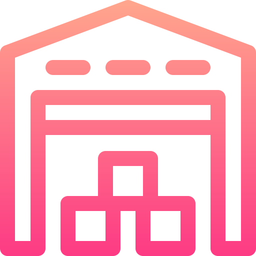

<div id="top"></div>

<!-- badges -->
<div align="center" >
	
[](https://www.python.org/)
[](https://www.javascript.com)
[](https://GitHub.com/Naereen/badges/)
[](https://html.com/html5/)
[](https://en.wikipedia.org/wiki/CSS)
[](https://pandas.pydata.org/)
[](https://www.json.org/json-en.html)
[](https://getbootstrap.com/)
[](https://flask.palletsprojects.com/en/1.1.x/)
[](https://github.com/omar-sherif9992)
[](https://www.heroku.com/)
[](https://analytics.google.com/analytics/web/provision/#/provision)
[](https://www.jetbrains.com/pycharm/)


</div>
<h1 align="center">Hi , I am Omar Sherif Ali </h1>
<h3 align="center">Computer Science Engineer | FullStack Web & API Developer </h3>

<br>


<a href="https://osa-warehouse-api.herokuapp.com/register"><h1 align="center">Welcome to OSA-WareHouse-API</h1></a>


<div align="center">
  <a href="https://osa-warehouse-api.herokuapp.com/">
    
  </a>

  <h3 align="center">E-commerce API</h3>

  <p align="center">
    An E-commerce API to aid Developers for their E-commerce practice projects!
    <br />
    <a href="https://documenter.getpostman.com/view/17286684/UUy65PqF"><strong>Explore the docs »</strong></a>
    <br />
    <br />
    <a href="https://osa-warehouse-api.herokuapp.com/">View The WareHouse API</a>
    ·
	     <a href="https://osa-warehouse-api.herokuapp.com/register">Get Your api_key</a>
    ·
    <a href="mailto:osa.helpme@gmail.com?subject=UnExpected%20Error%20Occured&body=Sorry%20for%20the%20inconvenience%2C%20Please%20describe%20Your%20situation%20and%20emphasis%20the%20Endpoint%20!%0A">Report Bug</a>
   	      ·
    <a href="mailto:osa.helpme@gmail.com?subject=I%20want%20to%20be%20a%20Contributor%20to%20OSA-WareHouse-API&body=Dear%20Omar%20Sherif%2C%0A%0A%3D%3D%3E%20name%0A%3D%3D%3E%20email%0A%3D%3D%3E%20phone%20number%0A%3D%3D%3E%20github%20link%0A%0A%0A%0ANeeded%20Skills%3A%0A%0A1-Familiar%20with%20Python%0A2-Familiar%20with%20BeautifulSoup%0A3-Familiar%20with%20csv%0A4-Familiar%20with%20pandas%20%0A%0AI%20acquire%20all%20those%20needed%20Skills.%0A%0Aregards">Be a Contributer</a>
  </p>
</div>

<a href="https://osa-warehouse-api.herokuapp.com/register">WareHouse API</a>

## 💡 Description
As someone who is willing to practice creating e-commerce websites, It is a struggle to find some Real and High Quality Data as a placeholder while on development stage. So this API's job is to help Developer's to reach out to this data that can help them and make it easier .

## ⚠️ Disclaimer  
Users who will Use this Data should only use it for Practice and <strong>not for Commercial Purposes !</strong>


<a href="https://osa-warehouse-api.herokuapp.com/"><h2>WareHouse API Features </h2></a>
<ul>
<li><strong>Reach Out</strong> To Product data with wide varieties of categories and sub-categories from Popular up-to-date Ecommerce Sources</li>
<li><strong>Data Format
</strong>Data is formatted in JSON Format according to standards.</li>
<li><strong>Product Upload</strong>The API Accepts only quality data that succeeds only with the API Data Validators to insure Real and High Quality Data</li>
<li><strong>Product Storage and Download into Excel file
</strong>User and Companies can store their Product Data into their Inventory and later on they can download it easily in a well formatted Excel File including all of their Products and their details</li>
<li><strong>Profile Storage and Download into Excel file
</strong>User and Companies can store their Profile Information Data and later on they can download it easily in a well formatted Excel File including all of their Products and their details</li>
<li><strong>Search Products by Filters
</strong>The WareHouse API contains many filter options when searching for Products</li>
<li><strong>Upload Inventory by Excel File
</strong>The WareHouse API is able to read Excel File but under certain conditions to upload all the User's Product faster and easier</li>
<li><strong>User control their Product
</strong>User can control their product's in terms of Safety , changing Product's info or deleting a Product</li>
</ul>	
	
	

<h3> User Features </h3>
<hr>
<ul>
<li>name : represents the User's name <strong>Required </strong></li>
<li>email : represents the User's email <strong>Required</strong></li>
<li>phone : represents the User's phone <strong>Required</strong></li>
<li>country : represents the User's country <strong>Required</strong></li>
<li>api_key : represents the User's Api Key which is the key that give's access to the User to use the WareHouse API <strong>Required</strong></li>
<li>status : represents the User's status either Company or User <strong>Required</strong></li>
<ul>
<li> <em><strong>Company</strong></em></li>

<ul>
<li>service : represents the Company's service <strong>Required</strong></li>
<li>company_url : represents the Company's url <strong>Required</strong></li>
</ul>
</ul>
<ul>
<li> <em><strong>User</strong></em></li>
<ul>
<li>birth_date : represents the User's birth date <strong>Required</strong></li>
<li>gender : represents the User's gender <strong>Required</strong></li>
</ul>
</ul>

<li>since : represents when did the user signed up for the WareHouse API auto <strong>Not-Required</strong></li>

</ul>
<p align="right">(<a href="#top">back to top</a>)</p>


<h3> Product Features </h3>
<hr>
<ul>
<li>product_name : represents the Product's name <strong>Required</strong></li>
<li>category : represents Category of the product <strong>Required</strong></li>
<li>sub_category : represents Sub-category of the product <strong>Not-Required</strong>as not every Company has that feature</li>
<li>brand : represents the Product's Brand    <strong>Required</strong></li>
<li>price : represents the Product's  Price    <strong>Required</strong></li>
<li>img_url : represents the Product's img_url  <strong>Required</strong></li>
<li>category : represents the if the Product is in the WareHouse or out of Stock<strong>Required</strong></li>
<li>delivery : represents the if Product have Delivery option    <strong>Required</strong></li>
<li>product_description : represents the Product's description  <strong>Required</strong></li>
<li>currency : represents the Product's price currency <strong>Required</strong></li>

<li>product_url : represents the Product's original page url <strong>Required</strong></li>
<li>source_name : represents the Product's price currency <strong>Required</strong></li>
<li>rating : represents the Product's rating <strong>Required</strong></li>
<li>release_date : represents when did the Product is Uploaded to the API   <strong>Required</strong></li>
<li>product_id : represents the Product's id which is hashed unique for every product for the owner can share to user who doesnt own it so he can view and edit it. <strong>Required</strong></li>
<li>secure : hashes  the product_id  for a product and it will be sent via email with it qr-code for the owner can share to user who doesn't own it so he can view and edit it. <strong>Not-Required </strong>
default = false</li>	
</ul>
<p align="right">(<a href="#top">back to top</a>)</p>


<h3>JSON Data Format Example :</h3>

```{
    "response": {
        "data": {
            "number_of_products": 1,
            "products": [
                {
                    "product_1": {
                        "owner": {
                            "country": "Egypt",
                            "email": "demo@gmail.com",
                            "gender": "Male",
                            "name": "Nour",
                            "number_of_products": 1,
                            "phone": "+021008757777",
                            "since": "October 7,2021",
                            "status": "User"
                        },
                        "product": {
                            "available": true,
                            "brand": "Polo",
                            "category": "Clothes",
                            "currency": "EGP",
                            "delivery": true,
                            "img_url": "https://m.media-amazon.com/images/I/610zGpHMF0L._AC_SY550_.jpg",
                            "price": 46,
                            "product_description": "100% Cotton",
                            "product_name": "Us. Polo Assn. Cotton Contrast-Logo Ribbed Trims Round-Neck Sweatshirt For Boys",
                            "product_url": "https://www.amazon.eg/-/en/US-Polo-Assn-Contrast-Logo-Round-Neck/dp/B08WJNLZF6/ref=lp_18018165031_1_11?th=1",
                            "rating": "4.2 out of 5",
                            "release_date": "October 7,2021",
                            "source_name": "Amazon"
                        }
                    }
                }
            ]
        },
        "success_message": "Products Found"
    },
    "status": "success"
}
```

<p align="right">(<a href="#top">back to top</a>)</p>


## 💻️ Languages & Concepts Used

* Python [(programming)](https://en.wikipedia.org/wiki/Python_(programming_language))
* [Object-oriented programming (OOP)](https://en.wikipedia.org/wiki/Object-oriented_programming#:~:text=Object%2Doriented%20programming%20(OOP),(often%20known%20as%20methods)) (Encapsulation, Abstraction, Inheritance, and Polymorphism)
* [Exception Handling](https://en.wikipedia.org/wiki/Exception_handling)
* [Flask](https://flask.palletsprojects.com/en/2.0.x/)
* Databases: SQLite using [SQLAlchemy](https://flask-sqlalchemy.palletsprojects.com/en/2.x/) (locally) and [PostgreSQL](https://www.heroku.com/postgres) (externally)
* HTML
* CSS
* Javascript
* [Bootstrap](https://getbootstrap.com/)
* [Jinja2](https://jinja.palletsprojects.com/en/3.0.x/) (For templating)
* [Heroku](https://www.heroku.com/) (Website Deployment)

<p align="right">(<a href="#top">back to top</a>)</p>


## Postman
<p>Used Postman to help me to test my program and write the <a href="https://documenter.getpostman.com/view/17286684/UUy65PqF">Documentation</a></p>
<a href="https://www.getpostman.com/"></a><br />


# FrameWork
* [Flask](https://en.wikipedia.org/wiki/Flask_(web_framework))

## Libraries Used
* Selenium : for website flow testing
* BeatufilSoup : for Scraping the Product's data
* qrcode : for creating a unique Qrcode for User's Inventory
* Pandas & Csv : for creating and manipulating Excel files uploaded and downloaded by the user.
* urlshortners: for creating short urls


## Author: <i>Omar Sherif Ali - OSA</i>
<p align="right">(<a href="#top">back to top</a>)</p>

<div align="center">
<h2> Connect with me  </h2>
<a href="https://github.com/omar-sherif9992">
	
</a>
<a href="https://www.linkedin.com/in/omar-sherif-2152021a3/">
	
</a>

<a href="mailto: omar.sherif9992@gmail.com">
	
</a>
<a href="https://www.youtube.com/channel/UCt0eXFStNA2oX5AqMjIBprw">
	
</a>
</div>
<br>
<div align="center">
<a href="https://www.youtube.com/channel/UCt0eXFStNA2oX5AqMjIBprw">
	</a>	


<p  align="center">Made with ❤️ by Omar Sherif Ali - OSA.</p>
<p  align="center">© OSA - 2021</p>
<p align="right">(<a href="#top">back to top</a>)</p>

